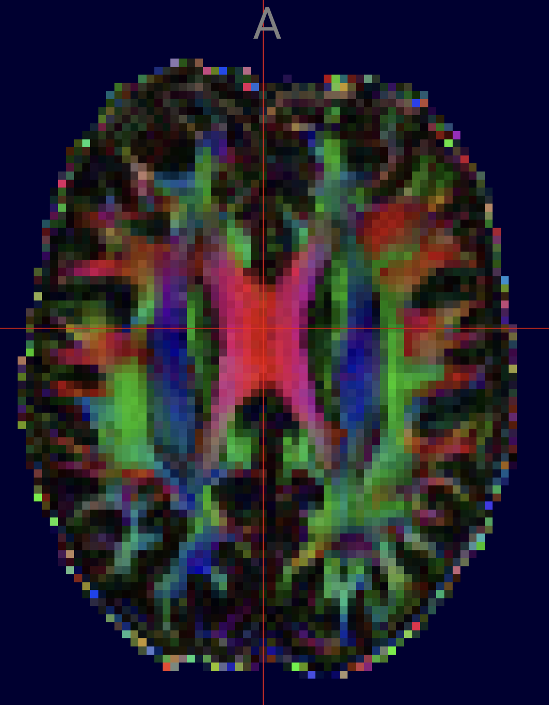
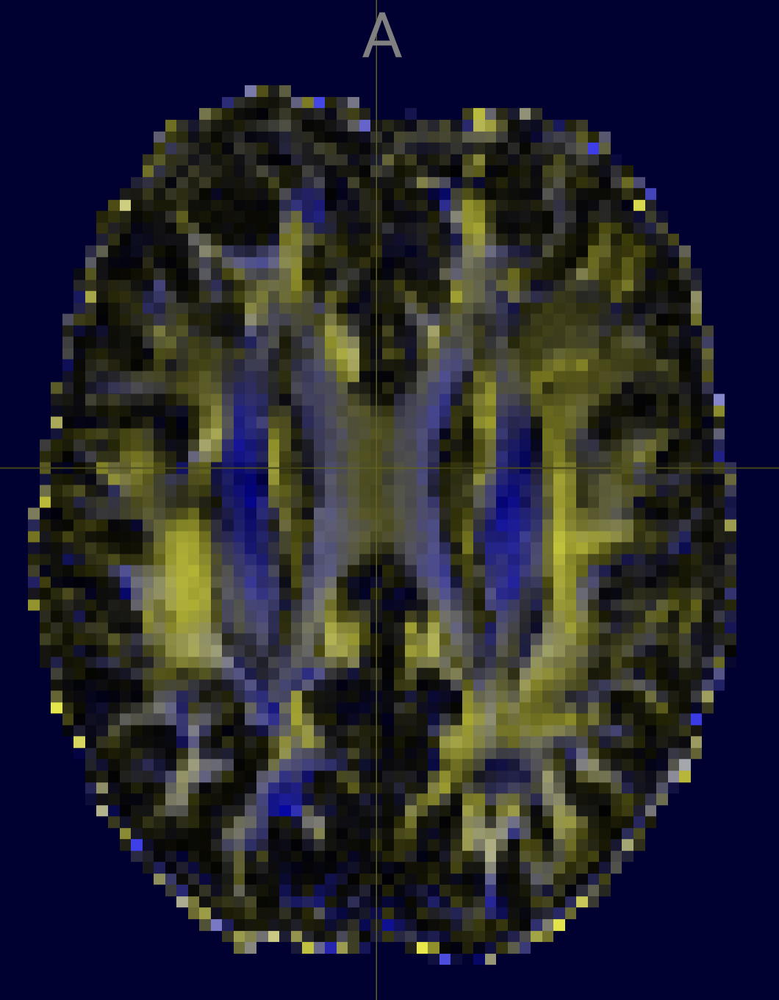
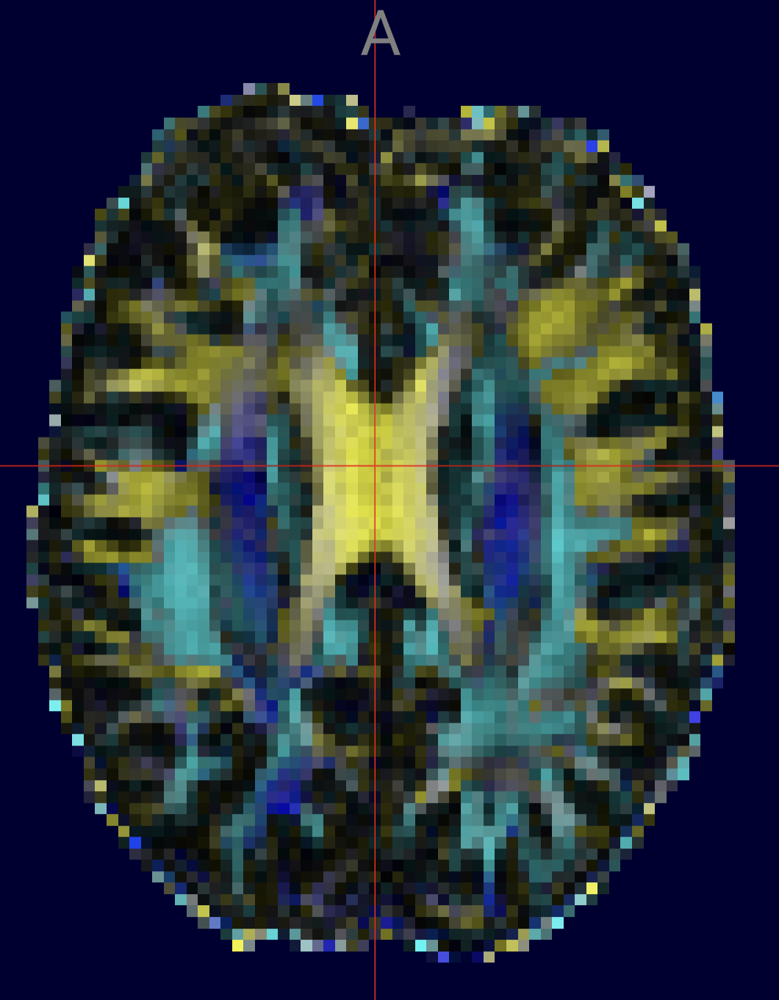
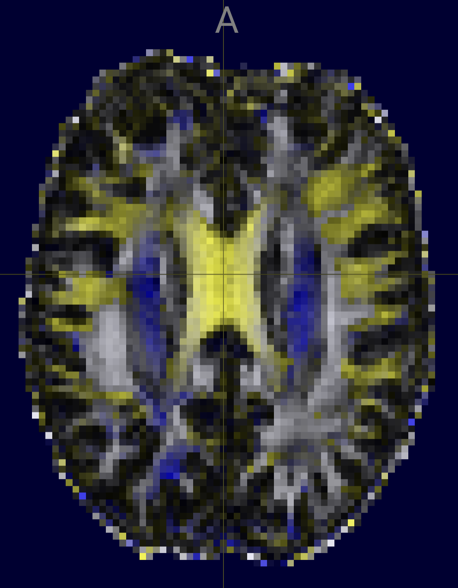

# OpenDIVE

[DIffusion Visualization for Everyone](https://github.com/brainhack-vandy/brainhack-vandy.github.io/issues/59). Despite the prolific availability of software tools to visualize diffusion MRI data, there is no standardized visualization software. Similarly, the current standard of visualizations are not accessible to people with common forms of colorblindness. We propose a software package to both standardize and improve accessibility to representations of diffusion data.

This is a NiiVue live demo to demonstrate one possible color mapping useful for individuals with Protanopia and Deuteranopia. You can use the [Colorblindly Chrome browser plugin](https://chromewebstore.google.com/detail/colorblindly/floniaahmccleoclneebhhmnjgdfijgg?hl=en) to simulate colorblindness in your web browser.


|                | Trichromacy             | Protanopia              |
|----------------|-------------------------|-------------------------|
| **RGB**        |  |  |
| **CYB**        |  |  |


## Usage

You can run a hot-reloadable live demo

```
git clone git@github.com:neurolabusc/OpenDIVE.git
cd OpenDIVE
npm install
npm run dev

```
